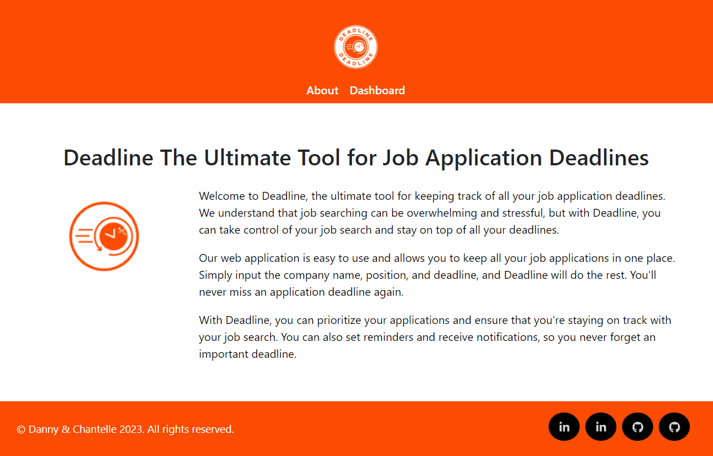

<h2 align="center">
Deadline 
</h2>

Welcome to Deadline, the ultimate tool for keeping track of all your job application deadlines. We understand that job searching can be overwhelming and stressful, but with Deadline, you can take control of your job search and stay on top of all your deadlines.

Our web application is easy to use and allows you to keep all your job applications in one place. Simply input the company name, position, and deadline, and Deadline will do the rest. You'll never miss an application deadline again.

With Deadline, you can prioritize your applications and ensure that you're staying on track with your job search. You can also set reminders and receive notifications, so you never forget an important deadline.

## Built With

Deadline was built using these technologies:

- React.js
- Sass
- React-Router
- React-Icons
- Node.js
- Bootstrap

## 🛠 Installation and Setup Instructions

1. Installation: `npm install`

2. In the project directory, you can run: `npm start`

